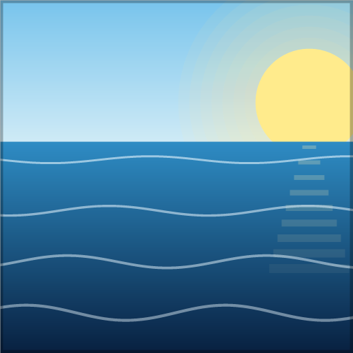

# High Water

**Floods the entire Overworld up to y=256 — survive an endless ocean with no dry land.**

---

## English

A data pack that turns the Overworld into one giant ocean. Sea level is raised to **y=256** and aquifers are disabled, so water fills everything below it. Vanilla terrain and biomes still generate — they're just submerged. Mountains become rare underwater ridges; dry land is gone.

Built for boat survival, "ocean only" challenges, and hardcore runs where every block of dirt is precious.

### Features
- 🌊 **Flooded world** — sea level 63 → 256, aquifers off, one uniform ocean.
- 🏝️ **Vanilla terrain & biomes**, fully submerged.
- 🚫 **No floating land structures** — villages, pillager outposts, witch huts, igloos, desert pyramids, jungle temples, woodland mansions and ruined portals are disabled.
- 🚢 **Underwater & buried structures still spawn** — shipwrecks, ocean ruins, trail ruins, ocean monuments, buried treasure, and all underground structures.
- 🟩 **Wandering Trader sells grass blocks** (1 emerald → 4), so dirt isn't impossible in a world with no land.
- 🏆 **Custom advancement tab "High Water"** — 20 themed advancements.

### Downloads
Ready-to-use ZIPs are in [`dist/`](dist):
- [`high_water_256_en.zip`](dist/high_water_256_en.zip) — advancements in **English**
- [`high_water_256_ua.zip`](dist/high_water_256_ua.zip) — advancements in **Ukrainian**

The unpacked sources live in [`en/`](en) and [`ua/`](ua). Pick **one** build — don't load both in the same world.

### Installation (apply when CREATING the world)
World-generation settings are locked in at world creation — adding the pack to an existing world will **not** flood it.
1. **Singleplayer → Create New World → More → Data Packs**.
2. Drag the chosen ZIP onto the screen and move it to the **Selected** column.
3. Create the world — you'll spawn underwater.

> The advancements and the trade also work on an existing world via `/reload`; only the flooding and structure changes require a fresh world.

### Tips
- **Lava & obsidian:** with aquifers off, caves are water-filled from y=-54 up to y=256. Natural lava only exists **below y=-54** (just above bedrock). Dig down to ~y=-55, then pour water on the lava to make obsidian.

### Compatibility
- Minecraft **26.2** (data pack format 107).
- Server-side / world-gen only — no client mod required. Works in vanilla and with Fabric / Sodium / Iris.

### Localization
Advancement strings live in [`translations/`](translations) (`en_us.json`, `uk_ua.json`). Contributions for more languages are welcome.

---

## Українською

Набір даних, що перетворює Звичайний світ на один величезний океан. Рівень моря піднято до **y=256**, а водоносні шари вимкнено, тож вода заповнює все нижче. Ванільний рельєф і біоми генеруються як завжди — просто затоплені. Гори стають рідкісними підводними хребтами; суші немає.

Створено для виживання на човні, челенджів «лише океан» і хардкорних проходжень, де кожен блок землі — на вагу золота.

### Можливості
- 🌊 **Затоплений світ** — рівень моря 63 → 256, водоносні шари вимкнено, суцільний океан.
- 🏝️ **Ванільний рельєф і біоми**, повністю під водою.
- 🚫 **Жодних наземних структур, що спливають** — села, застави розбійників, хатинки відьом, іглу, пустельні храми, храми в джунглях, особняки та зруйновані портали вимкнено.
- 🚢 **Підводні та закопані структури генеруються** — затонулі кораблі, океанські руїни, стежкові руїни, океанські монументи, закопані скарби й усі підземні структури.
- 🟩 **Мандрівний торговець продає дерен** (1 смарагд → 4), щоб землю можна було дістати у світі без суші.
- 🏆 **Власна вкладка досягнень «Велика вода»** — 20 тематичних досягнень.

### Завантаження
Готові ZIP-файли — у теці [`dist/`](dist):
- [`high_water_256_en.zip`](dist/high_water_256_en.zip) — досягнення **англійською**
- [`high_water_256_ua.zip`](dist/high_water_256_ua.zip) — досягнення **українською**

Розпаковані джерела — у [`en/`](en) та [`ua/`](ua). Обери **одну** збірку — не вмикай обидві в одному світі.

### Встановлення (під час СТВОРЕННЯ світу)
Параметри генерації світу фіксуються при створенні — додавання набору до наявного світу його **не** затопить.
1. **Одиночна гра → Створити світ → Ще → Набори даних**.
2. Перетягни обраний ZIP у вікно та перенеси праворуч у «Вибрані».
3. Створи світ — ти з'явишся під водою.

> Досягнення й торгівля працюють і в наявному світі через `/reload`; затоплення та зміни структур потребують нового світу.

### Поради
- **Лава та обсидіан:** з вимкненими водоносними шарами печери залиті водою від y=-54 до y=256. Природна лава є лише **нижче y=-54** (одразу над корінною породою). Копай до ~y=-55, потім вилий воду на лаву, щоб отримати обсидіан.

### Сумісність
- Minecraft **26.2** (формат набору даних 107).
- Лише серверна частина / генерація світу — клієнтський мод не потрібен. Працює у ванілі та з Fabric / Sodium / Iris.

### Локалізація
Тексти досягнень — у теці [`translations/`](translations) (`en_us.json`, `uk_ua.json`). Переклади іншими мовами вітаються.

---

Made for Minecraft 26.2 · License: MIT

